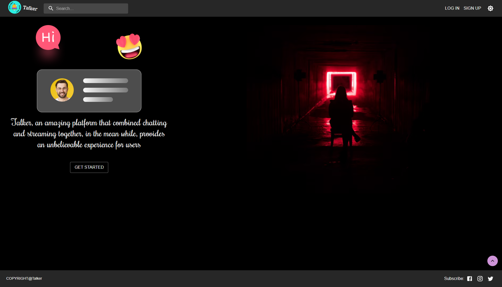

# Talker (Social Networking Application)
❤️ A MERN Stack, production-ready application that experienced agile software engineering cycle, **Design Prototype**, **Unit test**, **API Design**, **Implementation**, **Deploy stages**.

## Get Started
```
npm start
or 
npm run dev
```
## Functionality
 Login ✅
 Sign up ✅
 Form Validation ✅
 Add Friend ✅
 Live Notification ✅
 Live Chat ✅
 Live Post ✅
 Media Post ✅
 Create Group Chat ✅
 Group Authorization ✅
 Group post ✅
 Group Chat ✅
 Socket.io ✅
 JWT Auth ✅
 Infinite Scroll ✅


## Deployment
- Heroku: [https://fall-2021-social-network.herokuapp.com/](https://fall-2021-social-network.herokuapp.com/)
## App Overview



